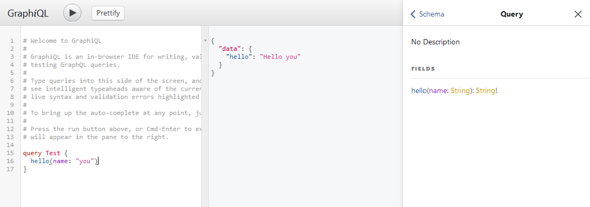

# GraphiQL PSR-15 Middleware

[](https://packagist.org/packages/dr-schopalopp/graphiql-middleware)
[](LICENSE)

Add a [GraphiQL](https://github.com/graphql/graphiql) interface to your application with this PSR-15 middleware.

This is basically a copy of [graphiql-middleware](https://github.com/rromanovsky/graphiql-middleware) adjusted for
PSR-15.

[](https://graphql.org/swapi-graphql)

## Install

```shell
composer require dr-schopalopp/graphiql-middleware
```

## Usage

This middleware was developed in a slim project, but it should work with any other PSR-15 compatible framework.

### Slim 4

```php
// app/dependencies.php

use DrSchopalopp\GraphiQLMiddleware\GraphiQLMiddleware;

return function (ContainerBuilder $containerBuilder) {
    $containerBuilder->addDefinitions([
        // ...
        
        GraphiQLMiddleware::class => function () {
            return new GraphiQLMiddleware();
        }
        
        // ...
    ]);
};
```

```php
// app/middleware.php

use DrSchopalopp\GraphiQLMiddleware\GraphiQLMiddleware;

return function (App $app) {
    // ...
    
    $app->add(GraphiQLMiddleware::class);
    
    // ...
};
```

```php
// app/routes.php

return static function (App $app) {
    // ...

    // dummy route necessary otherwise you will get an HTTP 405 Method Not Allowed error 
    $app->get('/graphiql', function (Request $request, Response $response) {
        return $response;
    });
    
    // ...
};
```
see [HTTP 405 Method Not Allowed](https://developer.mozilla.org/en-US/docs/Web/HTTP/Status/405) for details

## License

The MIT License (MIT). Please see [License File](LICENSE) for more information.
